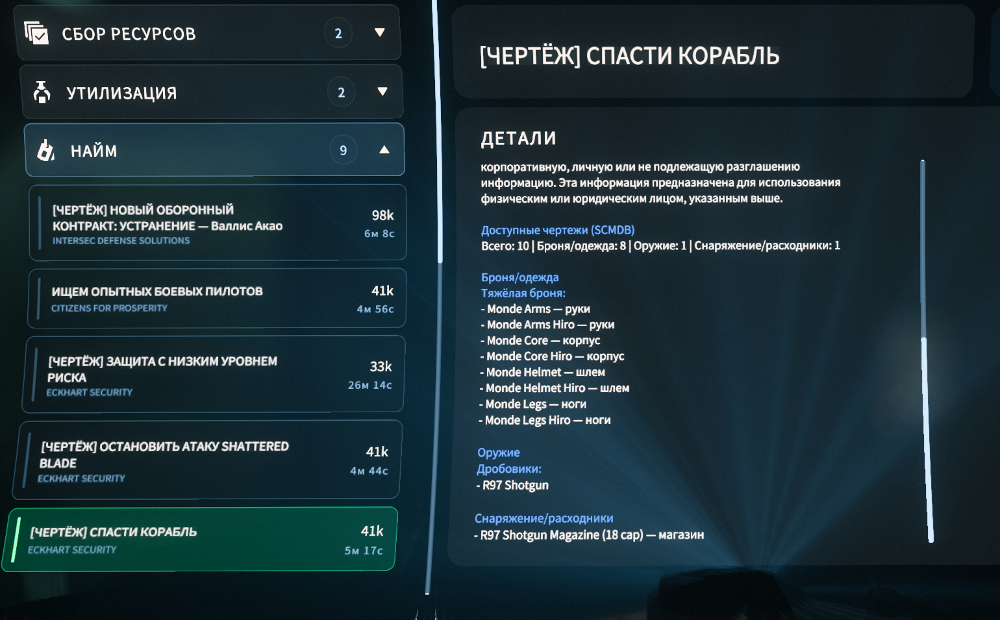
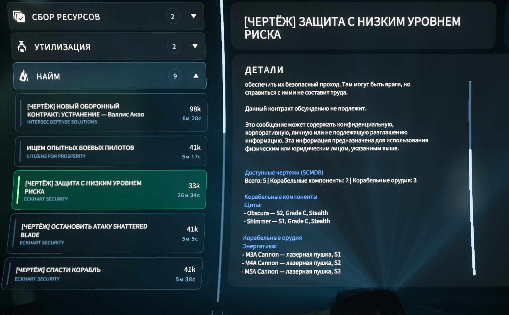
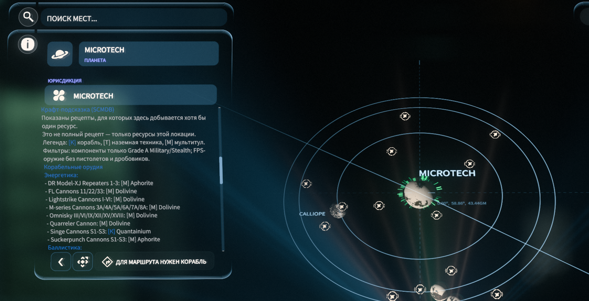

# Star Citizen

Моды и патчеры для Star Citizen.

## Скачать

### SCMDB Quest Recipe Patcher

Показывает в контрактах, какие чертежи/рецепты можно получить за миссию.

1. Установите русский перевод [RuSC](https://www.expanseunion.com/sc/locru).
2. Скачайте `SCMDB_Quest_Recipe_Patcher_v2.1.0.zip` на странице [Releases](https://github.com/johnniewalker89/my-game-modding/releases/tag/v2.1.0).
3. Распакуйте архив.
4. Запустите `SCMDB_Quest_Recipe_Patcher.bat`.
5. Выберите папку `StarCitizen\LIVE` и нажмите `Пропатчить`.

Подробная инструкция: [SCMDB_Quest_Recipe_Patcher/README.md](SCMDB_Quest_Recipe_Patcher/README.md).

## Как выглядит в игре

