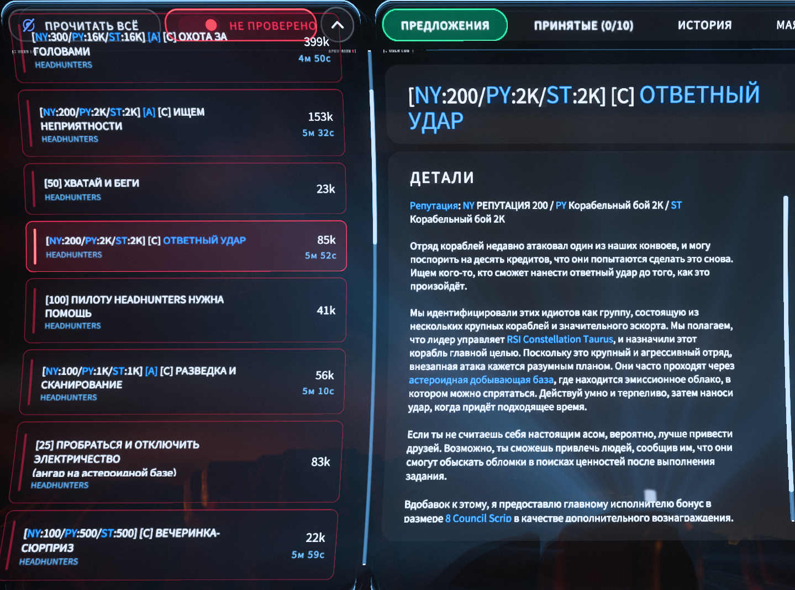
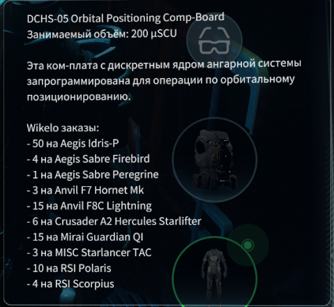

# Star Citizen

Моды и инструменты для Star Citizen.

## Скачать

### SC Mod Launcher

Основной проект: лаунчер для установки RuSC и безопасных модульных правок `global.ini`.

Что умеет:

- `Русификатор`: установка, обновление, удаление RuSC и fallback через локальный ZIP; используется перевод [StarCitizenRu](https://github.com/n1ghter/StarCitizenRu), лаунчер только дополняет его под свои модули.
- `Майнинг и крафт`: ресурсы по способам добычи, состав предметов, ТТХ оружия/компонентов Erkul, фильтры семейств рецептов, бонусы переработки и скупка сырой руды на refinery-станциях.
- `Квесты и рецепты`: чертежи в наградах, метки `[Ч]`, `[А]`, `[С]`, репутация, farm-подсветка и Wikelo-подсказки в предметах.
- `Проверка и cache`: диагностика источников, прогрев свежего cache и применение в LIVE без лишних realtime-запросов.
- `Backup и обновления`: восстановление `global.ini`, GitHub Releases, SHA-256 проверка и самообновление с сохранением backup/config.

Как поставить:

1. Скачайте `SC_Mod_Launcher_2.1.1.zip` на странице [Releases](https://github.com/johnniewalker89/my-game-modding/releases/tag/sc-mod-launcher-v2.1.1).
2. Откройте архив и извлеките из него папку `SC_Mod_Launcher` в удобное место. Не используйте внешнюю папку `SC_Mod_Launcher_2.1.1` как рабочую.
3. Запустите `SC_Mod_Launcher\SC_Mod_Launcher.exe`.
4. Проверьте путь к `StarCitizen\LIVE`.
5. На вкладке `Русификатор` установите или обновите RuSC, если он ещё не стоит. Если GitHub API не открывается, скачайте ZIP [StarCitizenRu](https://github.com/n1ghter/StarCitizenRu) вручную и нажмите `Из ZIP`. Если RuSC уже был установлен вручную или старой версией лаунчера, рекомендуем удалить его и поставить заново через лаунчер, чтобы появились metadata версии.
6. Нажмите `Проверить`, при необходимости `Прогреть кэш`, затем `Применить в LIVE`.

SHA-256 релиза `2.1.1`:

```text
56C5A462BFC9D42C23A0C63720EB1819611E0AFD0C3AF204F2E0E84FB475577F
```

Подробности: [SC_Mod_Launcher/README.md](SC_Mod_Launcher/README.md).

## Как выглядит SC Mod Launcher в игре

### Квесты и рецепты

Лаунчер добавляет в описания контрактов список чертежей, которые можно получить за миссию, и оставляет только выбранные категории.

Метки в названии контракта:

- `[Ч]` — в награде есть выбранные категории чертежей.
- `[А]` — контракт для асов-пилотов.
- `[С]` — в награде есть скрипты; особенно выгодные контракты дополнительно подсвечиваются синим.

<table>
  <tr>
    <td width="50%"></td>
    <td width="50%"></td>
  </tr>
  <tr>
    <td colspan="2"></td>
  </tr>
</table>

### Майнинг и крафт

На планетах и лунах показываются ресурсы по способам добычи и рецепты предметов, которые можно собрать из местных ресурсов. На refinery-станциях можно включить подсказки по бонусам и штрафам переработки.

<table>
  <tr>
    <td width="50%"></td>
    <td width="50%"></td>
  </tr>
  <tr>
    <td colspan="2"></td>
  </tr>
</table>

### Общие подсказки предметов

ТТХ оружия и корабельных компонентов добавляются прямо в описание предметов.

<table>
  <tr>
    <td width="50%"></td>
    <td width="50%"></td>
  </tr>
</table>

## SC Route Helper

Вспомогательный инструмент для диагностики сетевой ошибки `30000` и подготовки zapret bat на основе уже рабочего bat-файла.

1. Установите и настройте [zapret](https://github.com/flowseal/zapret-discord-youtube), чтобы у вас уже был рабочий zapret `.bat`.
2. Скачайте `SC_Route_Helper_v1.0.0.zip` на странице [Releases](https://github.com/johnniewalker89/my-game-modding/releases/tag/sc-route-helper-v1.0.0).
3. Распакуйте архив.
4. Запустите `SC_Route_Helper.bat`.
5. Выберите папку `StarCitizen\LIVE`.
6. Выберите рабочий zapret `.bat`, на основе которого нужно создать новый.
7. Нажмите `Проверить игру`.
8. Нажмите `Начать запись`, запустите Star Citizen и доведите игру до ошибки `30000`.
9. Вернитесь в helper и нажмите `Остановить и разобрать`.
10. Нажмите `Создать bat` и запускайте созданный `_SC_...bat` вместо старого.

Подробности: [SC_Route_Helper/README.md](SC_Route_Helper/README.md).

