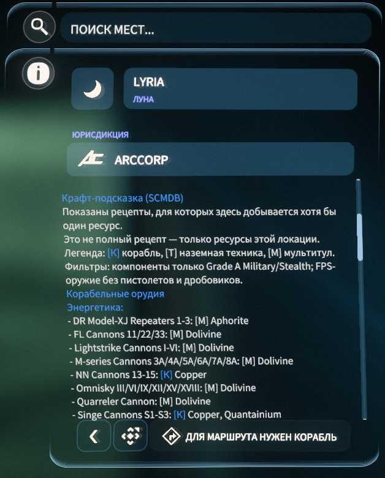

# Star Citizen

Моды и патчеры для Star Citizen.

## Скачать

### SC Route Helper

Помогает игроку поймать сетевую ошибку `30000` в `Game.log`, накопить IP-кандидаты Star Citizen и создать новый zapret bat на основе уже рабочего bat-файла.

1. Скачайте `SC_Route_Helper_v0.1.0.zip` на странице [Releases](https://github.com/johnniewalker89/my-game-modding/releases/tag/sc-route-helper-v0.1.0).
2. Распакуйте архив.
3. Запустите `SC_Route_Helper.bat`.
4. Выберите папку `StarCitizen\LIVE`.
5. Нажмите `Начать запись`, поймайте ошибку и нажмите `Остановить и разобрать`.

Подробная инструкция: [SC_Route_Helper/README.md](SC_Route_Helper/README.md).

### SCMDB Quest Recipe Patcher

Показывает в контрактах, какие чертежи/рецепты можно получить за миссию, где встречаются пилоты-асы и где дают обменные scrip/coin-награды.

1. Установите русский перевод [RuSC](https://www.expanseunion.com/sc/locru).
2. Скачайте `SCMDB_Quest_Recipe_Patcher_v2.2.2.zip` на странице [Releases](https://github.com/johnniewalker89/my-game-modding/releases/tag/v2.2.2).
3. Распакуйте архив.
4. Запустите `SCMDB_Quest_Recipe_Patcher.bat`.
5. Выберите папку `StarCitizen\LIVE` и нажмите `Пропатчить`.

Подробная инструкция: [SCMDB_Quest_Recipe_Patcher/README.md](SCMDB_Quest_Recipe_Patcher/README.md).

## Как выглядит в игре

