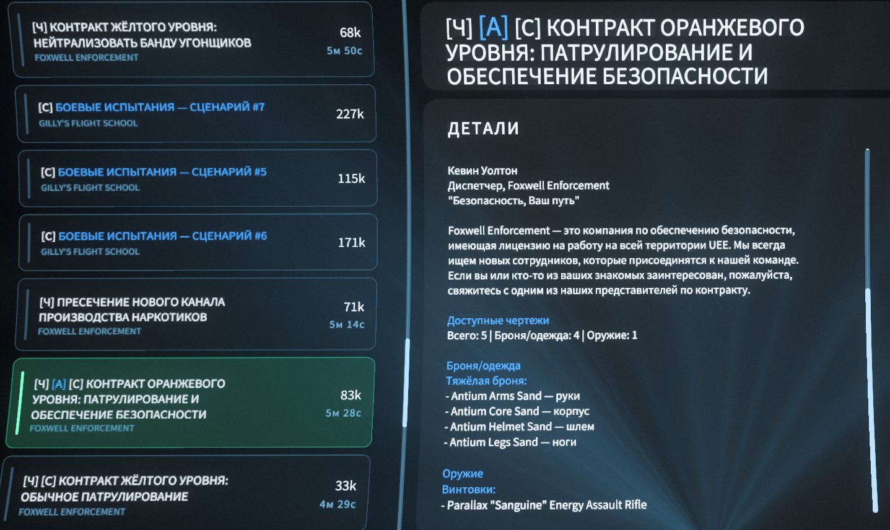
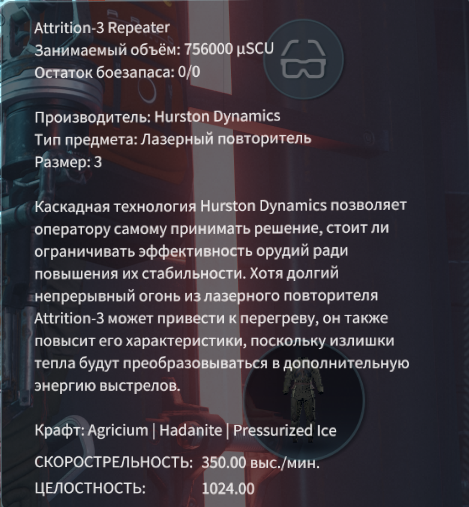
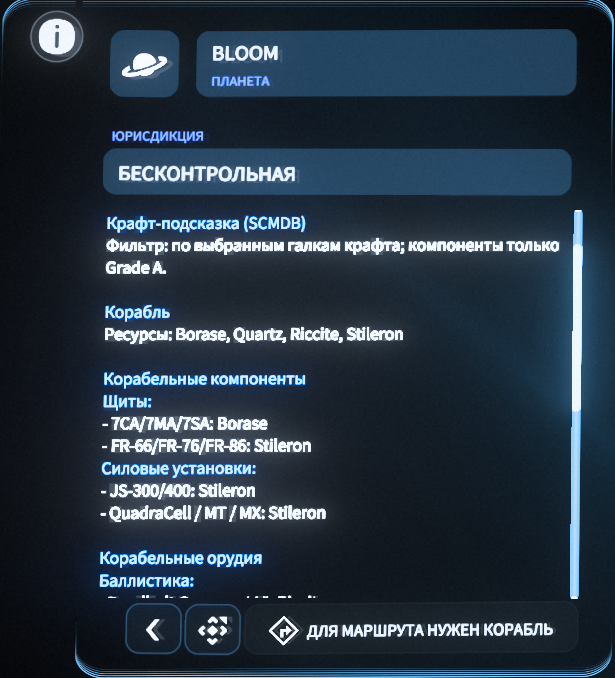

# Star Citizen

Моды и инструменты для Star Citizen.

## Скачать

### SC Route Helper

Вспомогательный инструмент для диагностики сетевой ошибки `30000` и подготовки zapret bat на основе уже рабочего bat-файла.

1. Установите и настройте [zapret](https://github.com/flowseal/zapret-discord-youtube), чтобы у вас уже был рабочий zapret `.bat`.
2. Скачайте `SC_Route_Helper_v1.0.0.zip` на странице [Releases](https://github.com/johnniewalker89/my-game-modding/releases/tag/sc-route-helper-v1.0.0).
3. Распакуйте архив.
4. Запустите `SC_Route_Helper.bat`.
5. Выберите папку `StarCitizen\LIVE`.
6. Выберите рабочий zapret `.bat`, на основе которого нужно создать новый.
7. Нажмите `Проверить игру`.
8. Нажмите `Начать запись`, запустите Star Citizen и доведите игру до ошибки `30000`.
9. Вернитесь в helper и нажмите `Остановить и разобрать`.
10. Нажмите `Создать bat` и запускайте созданный `_SC_...bat` вместо старого.

Подробности: [SC_Route_Helper/README.md](SC_Route_Helper/README.md).

### SC Mod Launcher

Основной проект: лаунчер модулей для безопасных правок `global.ini`.

Что умеет:

- `Майнинг и крафт`: подсказки по добыче на планетах и лунах, состав предметов в описаниях и вложенный выбор конкретных семейств рецептов: корабельные компоненты, орудия, добывающие лазеры, броня и FPS-оружие.
- `Квесты и рецепты`: списки чертежей в наградах контрактов, маркеры `[Ч]`, `[А]`, `[С]`, вложенные фильтры конкретных семейств рецептов и подсветка выгодных фарм-квестов.
- `Backup`: восстановление последнего или выбранного `global.ini`, удаление старых backup-файлов из лаунчера.
- `Обновления`: проверка GitHub Releases, скачивание ZIP, SHA-256 проверка, самообновление без потери backup/cache.

Как поставить:

1. Установите русский перевод [RuSC](https://www.expanseunion.com/sc/locru).
2. Скачайте `SC_Mod_Launcher_1.0.3.zip` на странице [Releases](https://github.com/johnniewalker89/my-game-modding/releases/tag/sc-mod-launcher-v1.0.3).
3. Откройте архив и извлеките из него папку `SC_Mod_Launcher` в удобное место. Не используйте внешнюю папку `SC_Mod_Launcher_1.0.3` как рабочую.
4. Запустите `SC_Mod_Launcher\SC_Mod_Launcher.exe`.
5. Проверьте путь к `StarCitizen\LIVE`.
6. Нажмите `Проверить`, при необходимости `Прогреть кэш`, затем `Применить в LIVE`.

SHA-256 релиза `1.0.3`:

```text
3E091731275D8083E3039697FF21C653ABEFA46B21ED208DEB5D522B70FE2F28
```

Подробности: [SC_Mod_Launcher/README.md](SC_Mod_Launcher/README.md).

## Как выглядит SC Mod Launcher в игре

### Квесты и рецепты

Лаунчер добавляет в описания контрактов список чертежей, которые можно получить за миссию, и оставляет только выбранные категории.

Метки в названии контракта:

- `[Ч]` — в награде есть выбранные категории чертежей.
- `[А]` — контракт для асов-пилотов.
- `[С]` — в награде есть скрипты; особенно выгодные контракты дополнительно подсвечиваются синим.



### Майнинг и крафт

На планетах и лунах показываются ресурсы по способам добычи и рецепты предметов, которые можно собрать из местных ресурсов.

<table>
  <tr>
    <td width="50%"></td>
    <td width="50%"></td>
  </tr>
</table>


