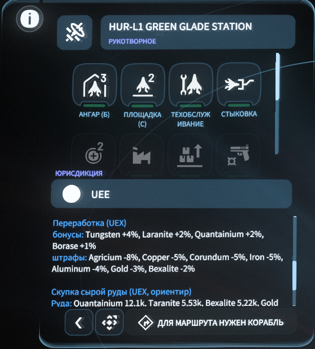
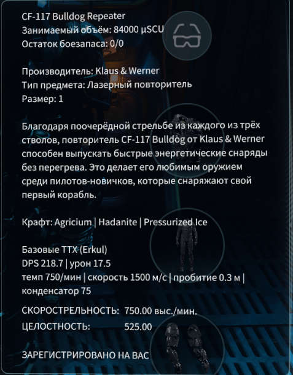
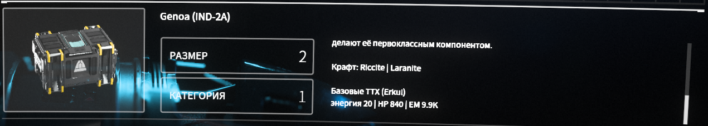

# SC Mod Launcher

Общий лаунчер для безопасных модов Star Citizen в зоне `global.ini`.

## Что уже есть

- выбор папки `StarCitizen\LIVE`;
- список модулей с галками и вложенными фильтрами семейств рецептов;
- новый WPF launcher shell в космопиратском sci-fi стиле (`SC_Mod_Launcher.exe`);
- модуль `Квесты и рецепты`: награды, чертежи, репутация и маркеры контрактов; конкретные семейства чертежей выбираются отдельно, метка `[Ч]` зависит от выбранного фильтра, а Wikelo-предметы получают подсказки по корабельным заказам;
- модуль `Майнинг и крафт`: фильтр методов добычи, состав предметов, ТТХ оружия/компонентов Erkul, бонусы переработки станций и выбор семейств рецептов;
- вкладка `Русификатор`: установка, обновление, удаление RuSC и установка из локального ZIP; лаунчер использует перевод ру сообщества [StarCitizenRu](https://github.com/n1ghter/StarCitizenRu);
- проверка источников/cache с краткой сводкой в бортовом журнале;
- явное применение в LIVE: проверка локального cache, backup `global.ini`, краткий боевой рапорт и кликабельный JSON-отчёт/диагностика;
- вкладка `Backup` для восстановления последнего или выбранного backup `global.ini` с предварительным backup текущего LIVE;
- проверка GitHub Releases для `SC_Mod_Launcher_*.zip`, скачивание ZIP, SHA-256 verify и helper самообновления с backup текущей папки лаунчера;
- автотест WPF: лаунчер собирается, запускается, проверяет ключевые русские кнопки/разделы и закрывается без зависшего процесса.

## Важно

Это версия `2.0.9` нового продукта. Игрок запускает один проект: `SC Mod Launcher` с набором модулей и встроенным управлением русификатором.

Лаунчер должен оставаться в безопасной зоне: только `global.ini`, backup/cache, UI модулей и документация. Без runtime-хуков, оверлеев, памяти, архивов игры и античита.

Кнопка `Проверить` проверяет источники и cache. Кнопка `Применить в LIVE` пишет настоящий `global.ini` и перед записью создаёт backup.

Если RuSC уже был установлен вручную или старой версией лаунчера, перед переходом на `2.0.9` рекомендуем удалить текущий русификатор и поставить его заново через вкладку `Русификатор`. Так лаунчер сохранит metadata RuSC и дальше сможет корректно показывать установленную и доступную версии.

Если у провайдера или сети не открывается `api.github.com`, можно скачать ZIP [StarCitizenRu](https://github.com/n1ghter/StarCitizenRu) вручную через браузер и поставить его кнопкой `Из ZIP` на вкладке `Русификатор`. Установка из ZIP проходит через те же backup, metadata и baseline-правки лаунчера.

Вкладка `Backup` показывает найденные backup-файлы из `backups\global.ini.*.sc-mod-launcher.bak`. Можно восстановить последний или выбранный файл, а выбранный backup удалить в корзину Windows. Перед откатом лаунчер сохраняет текущий LIVE в `backups\global.ini.<date>.before-restore.bak`.

Обновление лаунчера идёт через GitHub Releases. Релизный ZIP содержит `update-manifest.json`: updater проверяет SHA-256 пакета и файлов, зеркально обновляет управляемые файлы лаунчера, накатывает свежий cache из релиза, удаляет устаревшие остатки старых версий и сохраняет пользовательские `backups`, `config` и `updates\backups`.

## Как выглядит в игре

### Майнинг и переработка



### Общие подсказки предметов





## Запуск

Из релизного архива рекомендуется извлекать именно папку `SC_Mod_Launcher`. Внешняя папка, которую Windows создаёт через `Извлечь все`, может называться по версии архива (`SC_Mod_Launcher_2.0.9`) и не должна быть рабочим именем установки.

Основной лаунчер:

```text
SC_Mod_Launcher.exe
```

Для сборки WPF-приложения из исходников:

```powershell
.\tools\Build-WpfLauncher.ps1
```

Для сборки с автозапуском smoke-теста:

```powershell
.\tools\Build-WpfLauncher.ps1 -RunSmokeTest
```

Для полного релизного прогона перед ZIP:

```powershell
.\tools\Build-ReleaseZip.ps1
```

Для консольной проверки:

```powershell
.\SC_Mod_Launcher.ps1 -LivePath "C:\Games\StarCitizen\LIVE" -DryRun
```

Для явного применения в LIVE:

```powershell
.\SC_Mod_Launcher.ps1 -LivePath "C:\Games\StarCitizen\LIVE" -ApplyLive
```
